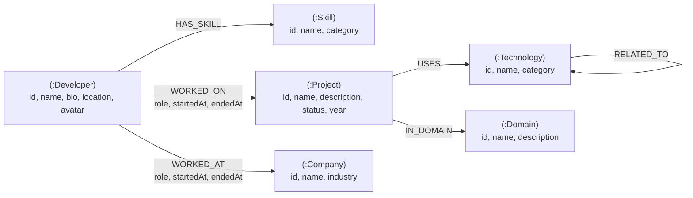

# SkillGraph - Developer Skills & Technology Relationship Explorer

[](https://nextjs.org/)
[](https://www.typescriptlang.org/)
[](https://neo4j.com/)
[](https://tailwindcss.com/)

SkillGraph is a production-quality developer skills and technology relationship explorer built as a take-home assignment for **Wexa AI**. 

Unlike conventional CRUD applications built on relational databases, SkillGraph models developers, skills, projects, technologies, companies, and domains as a graph network. This enables non-technical users and engineering leaders to navigate multi-hop relationships, uncover shared expertise, and analyze tech stacks.

---

## Features

- 📊 **Interactive Dashboard**: Real-time summary statistics of graph entities and total relationship edges.
- 👨‍💻 **Developer Directory & Graph Profiles**: Deep profile pages revealing direct skills, project histories, company alumni networks, and multi-hop connected technologies.
- 🔀 **Shared Skills Overlap Traversal**: Graph query identifying engineers sharing skills without expensive multi-table SQL JOINs.
- 🚀 **Projects Catalog**: Explore project technology stacks, domain classifications, and active engineering teams.
- ⚡ **Multi-Hop Technology Ecosystems**: Traversal across 1 to 2 relationship hops (`[:RELATED_TO*1..2]`) to discover complementary technology stacks.
- 🏢 **Companies & Industry Domains**: Traverse developer career paths and regional domain expertise.
- 🗺️ **Visual Graph Explorer**: 2D HTML5 Canvas force-directed graph renderer with zoom/pan, center isolation, node filtering, and relationship labels.
- 🎯 **Shortest Path Finder**: Execute openCypher `shortestPath()` queries between any two graph entities.
- 🛡️ **Robust State Management**: Full error handling, database connectivity status indicators, loading skeletons, and graceful fallback states.

---

## Why a Graph Database?

A traditional Relational Database Management System (RDBMS) performs well for simple table lookups (e.g. `SELECT * FROM developers WHERE id = 1`). However, real-world tech ecosystems are defined by **dense, arbitrary relationships**. 

In an RDBMS, answering a multi-hop query such as:
> *"Find all technologies connected to a developer through projects in a specific domain, and list other engineers who share skills with them"*

requires joining 5 to 7 junction tables (`developers`, `developer_projects`, `projects`, `project_technologies`, `technologies`, `project_domains`, `developer_skills`). As data grows, relational join operations suffer exponential performance degradation ($O(N^k)$).

### Comparison: Relational SQL vs. openCypher Graph

| Query Objective | Relational SQL Approach | CognoDB / openCypher Approach |
| :--- | :--- | :--- |
| **Multi-Hop Traversal** *(Dev &rarr; Project &rarr; Tech &rarr; Domain)* | Requires 5+ `JOIN` operations across foreign key junction tables. Slow and fragile to schema changes. | Direct pattern match: <br>`MATCH (d:Developer {id: $id})-[:WORKED_ON]->(p)-[:USES]->(t)-[:IN_DOMAIN]->(dom)` |
| **Shared Skills Overlap** | Requires self-JOINs on `developer_skills` with `GROUP BY` and `HAVING` aggregation. | Symmetric graph traversal: <br>`MATCH (d:Developer {id: $id})-[:HAS_SKILL]->(s)<-[:HAS_SKILL]-(other)` |
| **Variable Hop Recommendation** *(1 to 2 Hop Tech Tree)* | Requires recursive Common Table Expressions (`WITH RECURSIVE`), which are complex and CPU-heavy. | Native pattern hop range: <br>`MATCH (t:Technology {id: $id})-[:RELATED_TO*1..2]-(related)` |

In **CognoDB**, relationships are stored as first-class pointers (index-free adjacency). Traversing a relationship takes constant time $O(1)$ regardless of total graph size.

---

## Graph Data Model

The graph schema consists of 6 labeled node types and 6 typed relationship edges with key properties.



### Node Schema
- `(:Developer)`: `id`, `name`, `bio`, `location`, `avatar`
- `(:Skill)`: `id`, `name`, `category`
- `(:Project)`: `id`, `name`, `description`, `status`, `year`
- `(:Technology)`: `id`, `name`, `category`
- `(:Company)`: `id`, `name`, `industry`
- `(:Domain)`: `id`, `name`, `description`

### Relationship Schema
- `(:Developer)-[:HAS_SKILL]->(:Skill)`
- `(:Developer)-[:WORKED_ON {role, startedAt, endedAt}]->(:Project)`
- `(:Developer)-[:WORKED_AT {role, startedAt, endedAt}]->(:Company)`
- `(:Project)-[:USES]->(:Technology)`
- `(:Project)-[:IN_DOMAIN]->(:Domain)`
- `(:Technology)-[:RELATED_TO]->(:Technology)`

---

## Key Cypher Queries

All database queries in SkillGraph are strictly **parameterized** using `neo4j-driver` parameters to prevent Cypher injection vulnerabilities.

### 1. Multi-Hop Developer Connections
```cypher
MATCH (d:Developer {id: $id})
OPTIONAL MATCH (d)-[:HAS_SKILL]->(s:Skill)
OPTIONAL MATCH (d)-[wo:WORKED_ON]->(p:Project)
OPTIONAL MATCH (d)-[wa:WORKED_AT]->(c:Company)
OPTIONAL MATCH (d)-[:WORKED_ON]->(p2:Project)-[:USES]->(t:Technology)
RETURN d,
       collect(DISTINCT s) AS skills,
       collect(DISTINCT { project: p, role: wo.role, startedAt: wo.startedAt, endedAt: wo.endedAt }) AS projects,
       collect(DISTINCT { company: c, role: wa.role, startedAt: wa.startedAt, endedAt: wa.endedAt }) AS companies,
       collect(DISTINCT t) AS connectedTechnologies
```

### 2. Shared Skills Traversal
```cypher
MATCH (d:Developer {id: $developerId})-[:HAS_SKILL]->(s:Skill)<-[:HAS_SKILL]-(other:Developer)
WHERE other.id <> $developerId
RETURN other AS developer, collect(s) AS sharedSkills, count(s) AS overlapCount
ORDER BY overlapCount DESC
```

### 3. Multi-Hop Technology Ecosystem (1..2 Hops)
```cypher
MATCH (t:Technology {id: $id})
OPTIONAL MATCH (t)-[:RELATED_TO*1..2]-(related:Technology) WHERE related.id <> $id
RETURN t, collect(DISTINCT related) AS relatedTechnologies
```

### 4. Shortest Path Traversal
```cypher
MATCH (start {id: $sourceId}), (end {id: $targetId})
MATCH p = shortestPath((start)-[*]-(end))
RETURN [n IN nodes(p) | { id: n.id, name: n.name, label: labels(n)[0] }] AS pathNodes,
       [r IN relationships(p) | { type: type(r) }] AS pathRels
```

---

## Architecture & Project Structure

```
wexa/
├── app/
│   ├── api/                  # Next.js API Route Handlers (DB Layer Enclosure)
│   │   ├── health/           # DB connectivity status check
│   │   ├── stats/            # Graph statistics summary
│   │   ├── developers/       # Developer endpoints & shared skills query
│   │   ├── projects/         # Project endpoints
│   │   ├── technologies/     # Technology multi-hop endpoints
│   │   ├── companies/        # Company alumni endpoints
│   │   ├── domains/          # Domain experience endpoints
│   │   ├── search/           # Global fuzzy search
│   │   └── graph/            # Graph explorer & shortest path endpoints
│   ├── developers/           # Developer views
│   ├── projects/             # Project views
│   ├── technologies/         # Technology views
│   ├── companies/            # Company views
│   ├── domains/              # Domain views
│   ├── explorer/             # Visual Graph Explorer view
│   ├── layout.tsx            # App root layout with theme & navbar
│   └── page.tsx              # Main Dashboard
├── components/
│   ├── Navbar.tsx            # Header, DB status badge, search bar
│   ├── GraphCanvas.tsx       # 2D Canvas force-directed graph renderer
│   ├── ErrorBanner.tsx       # Graceful DB error component
│   ├── EmptyState.tsx        # Empty search/filter component
│   └── LoadingSkeleton.tsx   # Loading state skeletons
├── lib/
│   └── db/
│       ├── driver.ts         # Singleton neo4j-driver connection & session pool
│       └── queries.ts        # Typed openCypher parameterized query repository
├── scripts/
│   └── seed.ts               # Synthetic seed script for CognoDB
├── types/
│   └── index.ts              # TypeScript interfaces for nodes & edges
├── .env.example              # Template environment configuration
└── README.md
```

---

## Setup & Local Development

### 1. Prerequisites
- Node.js `v18.x` or `v20.x` or `v22.x`
- npm `v10.x`
- CognoDB Cloud instance credentials (URL, username, password)

### 2. Environment Setup
Clone the repository and install dependencies:
```bash
git clone https://github.com/your-username/skillgraph.git
cd skillgraph
npm install
```

Copy `.env.example` to `.env.local` and add your CognoDB credentials:
```bash
cp .env.example .env.local
```

Configure your credentials in `.env.local`:
```env
COGNODB_URI=bolt://your-cognodb-instance.cloud:7687
COGNODB_USERNAME=cognodb
COGNODB_PASSWORD=your_secure_password
```

### 3. Seed Database
Execute the automated database seeding script to reset and populate CognoDB with synthetic developers, projects, skills, technologies, companies, and domains:
```bash
npm run seed
```

*Output sample:*
```text
🚀 Starting CognoDB Database Seeding...
🧹 Clearing existing database graph data...
📦 Seeding Developers...
🧠 Seeding Skills...
🛠️ Seeding Technologies...
🚀 Seeding Projects...
🏢 Seeding Companies...
🌐 Seeding Domains...
🔗 Creating HAS_SKILL, WORKED_ON, WORKED_AT, USES, IN_DOMAIN, RELATED_TO relationships...
✅ Seeding Complete! Summary Stats:
 - Developers: 15
 - Projects: 10
 - Technologies: 15
 - Skills: 10
 - Companies: 5
 - Domains: 5
 - Total Relationships: 95
```

### 4. Run Application Locally
Start the Next.js development server:
```bash
npm run dev
```
Open [http://localhost:3000](http://localhost:3000) in your browser.

---

## Build & Deployment

To verify production build readiness:
```bash
npm run lint
npm run build
```

### Vercel Deployment Instructions
1. Push your code to GitHub.
2. Import your GitHub repository into [Vercel](https://vercel.com).
3. In Vercel Project Settings &rarr; Environment Variables, add:
   - `COGNODB_URI`
   - `COGNODB_USERNAME`
   - `COGNODB_PASSWORD`
4. Deploy! Next.js route handlers will safely connect to your live CognoDB cluster.

---

## AI Usage Disclosure

In accordance with assignment guidelines:
- **AI Coding Assistance**: AI tools (Gemini / Antigravity Agent) were utilized to assist with project scaffolding, Cypher query optimization, synthetic dataset curation, and documentation drafting.
- **Developer Review**: All architectural decisions, openCypher parameterization, driver connection pooling, state error fallbacks, and UI components were thoroughly reviewed, verified, and understood by the developer.
